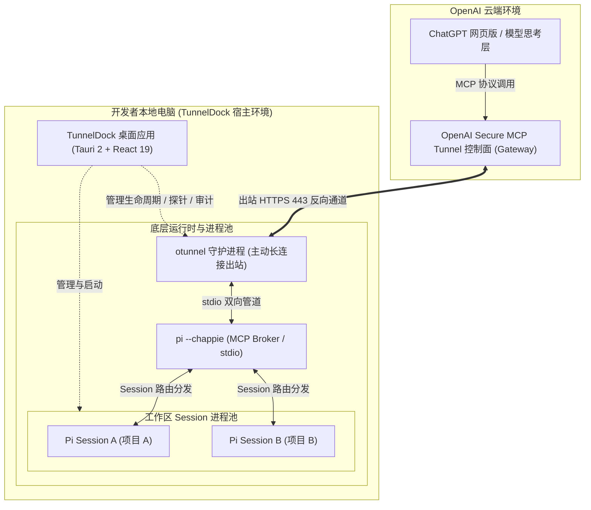
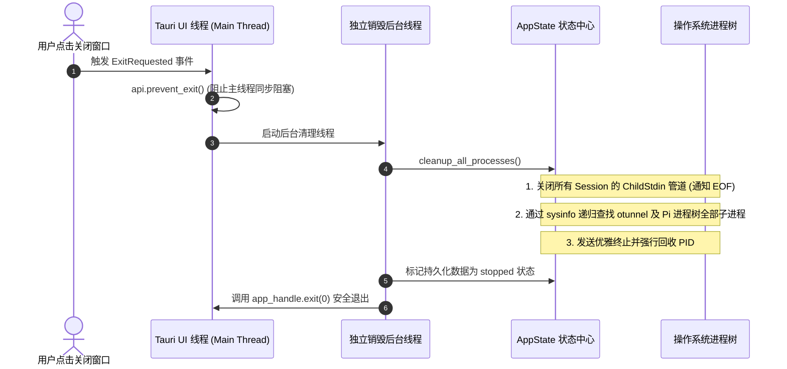

# TunnelDock 功能与核心原理解析

本文档系统性剖析开源项目 **TunnelDock** 的业务功能版图、系统架构设计以及核心底层技术原理，帮助开发者、架构师及开源贡献者深入理解其内部运作机制。

---

## 目录

- [一、项目定位与核心价值](#一项目定位与核心价值)
- [二、总体架构与网络穿透原理](#二总体架构与网络穿透原理)
  - [2.1 端到端拓扑结构](#21-端到端拓扑结构)
  - [2.2 反向隧道（Reverse Tunnel）安全穿透原理](#22-反向隧道reverse-tunnel安全穿透原理)
  - [2.3 职责解耦设计哲学](#23-职责解耦设计哲学)
- [三、核心功能模块与实现原理](#三核心功能模块与实现原理)
  - [3.1 环境依赖探测与流式跨平台自动安装](#31-环境依赖探测与流式跨平台自动安装)
  - [3.2 隧道守护进程（otunnel）生命周期与动态端口机制](#32-隧道守护进程otunnel生命周期与动态端口机制)
  - [3.3 深度健康体检（Doctor）与网络延迟探测](#33-深度健康体检doctor与网络延迟探测)
  - [3.4 多工作区与 Pi Session 进程池管理](#34-多工作区与-pi-session-进程池管理)
  - [3.5 MCP 工具调用审计与数据分析](#35-mcp-工具调用审计与数据分析)
  - [3.6 凭据隔离与动态配置渲染](#36-凭据隔离与动态配置渲染)
- [四、系统鲁棒性与跨平台工程实践](#四系统鲁棒性与跨平台工程实践)
  - [4.1 进程树优雅销毁与防假死机制](#41-进程树优雅销毁与防假死机制)
  - [4.2 Windows 隐匿后台运行（CREATE_NO_WINDOW）](#42-windows-隐匿后台运行create_no_window)
  - [4.3 版本平滑升级与历史数据无损迁移](#43-版本平滑升级与历史数据无损迁移)
  - [4.4 基于 Tauri Updater 的签名增量更新](#44-基于-tauri-updater-的签名增量更新)
- [五、技术栈与源码结构图谱](#五技术栈与源码结构图谱)

---

## 一、项目定位与核心价值

**TunnelDock** 是一款基于 **Tauri 2 (Rust)** + **React 19 (TypeScript)** 开发的桌面管理控制台。

### 核心解决的痛点
- **云端大模型无法直达本地代码库**：ChatGPT 网页版拥有强大的代码理解、推理和长上下文能力，但运行在 OpenAI 云端，无法直接读取、调试或修改开发者本地机器上的项目文件。
- **传统内网穿透方案的安全隐患**：常规暴露本地 HTTP 服务或配置公网 IP/端口转发的方式，存在未授权访问、安全扫描乃至全盘提权风险。
- **多组件联动复杂**：搭建由 `OpenAI Secure MCP Tunnel`、`otunnel`、`Chappie` 和 `Pi` 构成的开发环境，涉及大量命令行参数、进程保活、端口配置和凭据同步，普通开发者维护成本高。

TunnelDock 将上述复杂流程全生命周期桌面化、自动化管理，提供一键检测、自动化安装、守护进程监控、Session 路由分发及调用全量审计。

---

## 二、总体架构与网络穿透原理

### 2.1 端到端拓扑结构

TunnelDock 建立起的端到端调用拓扑如下：



### 2.2 反向隧道（Reverse Tunnel）安全穿透原理

传统客户端/服务端模型中，外部请求需要主动连接本地机器的监听端口（入站流量 Inbound）。这通常需要：
1. 本地具备公网静态 IP；
2. 在路由器上配置 NAT 端口转发；
3. 本地开放公网可见的端口并配置 TLS 证书。

**TunnelDock 采用的反向穿透模型原理：**
- 本地 `otunnel` 启动后，**主动向 OpenAI 官方网关发起出站（Outbound）HTTPS (443) 长连接**。
- 对本地操作系统与企业防火墙而言，这只是一次普通的对外网页浏览请求，无需变更任何防火墙策略或端口映射。
- 当 ChatGPT 发起 MCP 工具调用（例如 `read(path="src/main.rs")`）时，云端网关通过已建立的 443 反向通道将指令“推/拉”给本地的 `otunnel`。
- 本地完全不向外部公网暴露任何监听端口，杜绝了外网扫描和非授权入侵。

### 2.3 职责解耦设计哲学

本项目践行核心理念：**ChatGPT 负责思考与上下文，Pi 负责本地执行**。
- **云端**：大模型专精于语义理解、需求拆解、方案规划、长上下文管理和代码审查；
- **本地**：Pi 工具链专精于受控执行（文件读写、语法解析、Git 操作、运行 Bash、执行测试用例），本地无需再部署或重复调用第二个大型模型，最大程度降低本地算力与显存消耗。

---

## 三、核心功能模块与实现原理

### 3.1 环境依赖探测与流式跨平台自动安装

#### 探测矩阵与版本解析
TunnelDock 后端在启动或收到检测请求时，会在子进程中并发嗅探宿主机的 8 项核心组件：

| 探测目标 | 探测方式 | 语义判定逻辑 | 源码对应 |
| :--- | :--- | :--- | :--- |
| **Node.js** | 检索 PATH 中 `node`，执行 `node -v` | 解析主版本号，强制校验 `major >= 26` | [`commands/env.rs`](file:///c:/Users/Administrator/Documents/temp/code/aizeek/tunneldock/src-tauri/src/commands/env.rs) |
| **npm** | 检索 `npm` 并执行 `npm -v` | 验证可用性与版本 | [`commands/env.rs`](file:///c:/Users/Administrator/Documents/temp/code/aizeek/tunneldock/src-tauri/src/commands/env.rs) |
| **Git** | 检索 `git` 并执行 `git --version` | 检查版本控制工具就绪状态 | [`commands/env.rs`](file:///c:/Users/Administrator/Documents/temp/code/aizeek/tunneldock/src-tauri/src/commands/env.rs) |
| **Rust** | 检索 `rustc` 并执行 `rustc --version` | 校验本地编译与工具链支持 | [`commands/env.rs`](file:///c:/Users/Administrator/Documents/temp/code/aizeek/tunneldock/src-tauri/src/commands/env.rs) |
| **cargo-binstall** | 检索 `cargo-binstall` | 用于预编译二进制极速安装 | [`commands/env.rs`](file:///c:/Users/Administrator/Documents/temp/code/aizeek/tunneldock/src-tauri/src/commands/env.rs) |
| **otunnel** | 检索 `otunnel` 并执行 `otunnel --version` | 核心隧道二进制可用性 | [`commands/env.rs`](file:///c:/Users/Administrator/Documents/temp/code/aizeek/tunneldock/src-tauri/src/commands/env.rs) |
| **Pi** | 检索全局或 npm 路径下的 `pi` | 本地执行客户端状态 | [`commands/env.rs`](file:///c:/Users/Administrator/Documents/temp/code/aizeek/tunneldock/src-tauri/src/commands/env.rs) |
| **Chappie** | 检索 `~/.chappie/` 或全局 `chappie` | 检验代理配置文件与依赖 | [`commands/env.rs`](file:///c:/Users/Administrator/Documents/temp/code/aizeek/tunneldock/src-tauri/src/commands/env.rs) |

#### 流式事件驱动自动安装
在 [`commands/install.rs`](file:///c:/Users/Administrator/Documents/temp/code/aizeek/tunneldock/src-tauri/src/commands/install.rs) 中，安装过程不是简单的阻塞调用，而是基于 **Tauri Emitter 事件机制** 的流式推送：
1. 根据 OS 平台适配包管理器：
   - **Windows**：优先选用系统自带的 `winget install`，或调用 PowerShell 脚本下载官方 MSI；
   - **macOS**：优先使用 `brew install`；
   - **Node 生态**：对于 Pi / Chappie，调用 `npm install -g @zetaloop/chappie`。
2. 通过管道异步读取被执行命令的标准输出（`stdout`）和标准错误（`stderr`），每读取一行即发射 `install-progress` 事件至前端：
   ```rust
   // install-progress 事件载荷
   pub struct InstallProgressEvent {
       pub item_id: String,
       pub stage: String,      // "starting" | "downloading" | "installing" | "success" | "failed"
       pub log_line: String,
       pub is_error: bool,
   }
   ```
3. 前端常驻抽屉（`TerminalDrawer`）捕获事件，实现终端级别的高亮与实时滚动。

---

### 3.2 隧道守护进程（otunnel）生命周期与动态端口机制

#### 端口分配与 `.url` 临时文件回传机制
在旧版本中，健康检查端口往往被硬编码为 `8080`，极易因端口被占用导致启动崩溃。TunnelDock 设计了更加健壮的**动态端口与文件回传协议**（参见 [`commands/otunnel.rs`](file:///c:/Users/Administrator/Documents/temp/code/aizeek/tunneldock/src-tauri/src/commands/otunnel.rs)）：
1. 默认将端口设为 `0`（由操作系统内核自由分配闲置端口），避免任何冲突；
2. 启动 `otunnel` 时通过参数 `--health-url-file <TEMP_URL_PATH>` 指定一个专属临时文件路径：
   ```rust
   let health_url_file = create_health_url_file_path(&state)?;
   cmd.arg("--health-url-file").arg(&health_url_file);
   ```
3. `otunnel` 启动并成功监听回环地址后，会将绑定的实际基础 URL（如 `http://127.0.0.1:54321`）回写入该文件；
4. TunnelDock 在 10 秒超时窗口内以 100ms 为步长轮询读取该文件，校验必须为合法 `127.0.0.1` / `localhost` 格式，解析出真实端口并挂载到系统状态中。

---

### 3.3 深度健康体检（Doctor）与网络延迟探测

#### 双探针轮询
在守护进程运行期间，TunnelDock 定期轮询双探针：
- `/healthz`：轻量级存活探针（Liveness Probe），验证 otunnel 自身进程正常运转；
- `/readyz`：就绪探针（Readiness Probe），验证 otunnel 与云端控制面（Control Plane）之间的网络链路是否畅通。
- **延迟测算**：通过高精度计时器计算探针往返耗时（RTT，Round-Trip Time），并在前端仪表盘实时展示毫秒级延迟波动。

#### 8 项 Doctor 自愈诊断引擎
当隧道连接异常时，用户可一键运行 `run_otunnel_doctor`。后端将依次执行 8 项确定性诊断：
1. **配置文件存在性**：检查 `~/.chappie/chappie.yaml` 是否就绪；
2. **Tunnel ID 格式与匹配度**：校验配置中的 Tunnel ID 是否合规且与 UI 设置一致；
3. **API 凭据存在性**：检查 `~/.chappie/tunnelkey.txt` 是否存在且非空；
4. **API Key 权限特征检查**：校验是否具备 `Tunnels: Read/Use` 权限约束；
5. **otunnel 二进制可达性**：验证系统 PATH 是否可以调用 otunnel；
6. **MCP 代理命令探测**：检查 `pi --chappie` 是否能正常调起并响应；
7. **控制面网络连通性**：发起对 OpenAI 隧道服务端点的 TLS 握手检测；
8. **健康探针端口状态**：检测本地健康端口是否冲突。

每一项失败均会自动生成中文建议（`suggestion`），引导用户针对性修复。

---

### 3.4 多工作区与 Pi Session 进程池管理

#### 工作区元数据与 Git 嗅探
在 [`commands/workspace.rs`](file:///c:/Users/Administrator/Documents/temp/code/aizeek/tunneldock/src-tauri/src/commands/workspace.rs) 中，用户可以添加多个本地目录：
- 路径防重与合法性验证；
- 每次检索列表时，无阻塞执行：
  - `git branch --show-current`：获取当前分支；
  - `git status --porcelain`：实时统计未提交改动文件数量；
  让开发者在前端一目了然各项目的代码状态。

#### Session 进程与标准输入管道绑定
当用户点击「启动 Session」时：
1. 系统在目标项目路径下启动独立的子进程：
   ```bash
   pi --provider chappie --model chatgpt
   ```
2. 保持标准输入（`ChildStdin`）句柄，保存在 `AppState::running_workspace_stdins` 哈希映射表中；
3. 将 PID 保存在 `AppState::running_workspace_pids` 中；
4. 会话就绪后生成专属 Session ID，供 Chappie Broker 寻址。

#### 自动化绑定提示词生成（Prompt Generation）
为了减少用户在网页端的繁琐配置，TunnelDock 支持一键生成与 ChatGPT 绑定的系统级指令提示词：
```text
请切换到我的本地工作区：
- 工作区名称: <workspace_name>
- 本地绝对路径: <workspace_path>
- 会话 ID: <session_id>
- 操作系统: <os_name>

你可以通过 MCP 工具直接读取、修改该项目代码并执行测试。
```
开发者只需点击复制并发送给 ChatGPT 网页版，即可完成工作区绑定。

---

### 3.5 MCP 工具调用审计与数据分析

ChatGPT 对本地发起的操作均属于高敏感操作。TunnelDock 内置了全量审计引擎（[`commands/history.rs`](file:///c:/Users/Administrator/Documents/temp/code/aizeek/tunneldock/src-tauri/src/commands/history.rs) 与前端 `HistoryView.tsx`）：
- **全要素记录**：记录每一次调用的时间戳、所属 Session、工具名称（`read`、`write`、`edit`、`bash`、`git` 等）、入参 JSON、执行耗时（毫秒）、执行状态（`success` / `executing` / `error`）以及执行结果摘要。
- **本地统计与聚合**：
  - 自动汇总总调用量、成功率百分比、平均响应时间；
  - 支持按工具分类（文件类、Shell 类、会话类）、按成功/失败状态精确过滤；
  - 支持基于入参或摘要的模糊检索；
  - 支持将全量调用流水一键导出为标准的 `.json` 审计日志，供团队归档与追溯。

---

### 3.6 凭据隔离与动态配置渲染

TunnelDock 采用最小权限与配置分层存储原则：
- **凭据最小化暴露**：用户的 OpenAI Restricted API Key 存储在操作系统用户目录下的 `~/.chappie/tunnelkey.txt`，设置仅当前用户可读写，不与其他应用混合存储；
- **动态配置同步引擎**：在 [`utils/paths.rs`](file:///c:/Users/Administrator/Documents/temp/code/aizeek/tunneldock/src-tauri/src/utils/paths.rs) 中，任何设置变更（修改健康检查端口、切换 profile、更新 tunnel ID）都会触发自动渲染并同步更新 `~/.chappie/chappie.yaml`：
  ```yaml
  version: 1
  tunnel:
    id: <TUNNEL_ID>
    credentials_file: ~/.chappie/tunnelkey.txt
  health:
    listen: 127.0.0.1:<PORT>
  mcp:
    command: pi
    args: ["--chappie"]
  ```

---

## 四、系统鲁棒性与跨平台工程实践

### 4.1 进程树优雅销毁与防假死机制

在桌面操作系统（尤其是 Windows）中，管理多个长生命周期子进程极易出现“主窗口关闭了，后台仍有僵尸 node/pi 进程占用 CPU”或“关闭应用时弹窗提示程序未响应”的现象。TunnelDock 对此进行了深度治理（参见 [`src-tauri/src/lib.rs`](file:///c:/Users/Administrator/Documents/temp/code/aizeek/tunneldock/src-tauri/src/lib.rs) 与 [`state.rs`](file:///c:/Users/Administrator/Documents/temp/code/aizeek/tunneldock/src-tauri/src/state.rs)）：



- **事件防阻塞**：在 `ExitRequested` 事件中绝对不在 UI 线程做阻塞等待，而是通过 `api.prevent_exit()` 接管，在后台独立线程中完成终止操作后调用 `exit(0)`，从根源杜绝 Windows “应用程序无响应” 假死警告。
- **原子性保证**：通过 `AtomicBool` 状态标志保证销毁过程幂等，即使 `ExitRequested`、`Exit` 和 `Drop` 重复触发，销毁逻辑也仅执行一次。

### 4.2 Windows 隐匿后台运行（CREATE_NO_WINDOW）

在 Windows 平台执行命令行工具（如 `git`、`node`、`otunnel`、`pi`）时，默认会闪烁黑色控制台窗口（cmd.exe）。
TunnelDock 在所有调用底层 `std::process::Command` 的地方，均通过平台特性打标：
```rust
#[cfg(target_os = "windows")]
use std::os::windows::process::CommandExt;

const CREATE_NO_WINDOW: u32 = 0x08000000;

cmd.creation_flags(CREATE_NO_WINDOW);
```
确保所有守护进程和探针在后台完全静默执行，桌面体验干净清爽。

### 4.3 版本平滑升级与历史数据无损迁移

TunnelDock 经历了从 `local-mcp-console`、`chappie-desktop` 到 `TunnelDock` 的架构演进。为了保护用户的历史配置与工作区不丢失，在 [`state.rs`](file:///c:/Users/Administrator/Documents/temp/code/aizeek/tunneldock/src-tauri/src/state.rs) 初始化时内置了**平滑迁移引擎**：
1. 检查当前标准数据目录 `TunnelDock/` 是否存在；
2. 若不存在，按优先级探测历史遗留目录 `local-mcp-console/` 与 `chappie-desktop/`；
3. 检测到旧目录后优先尝试原子重命名（`fs::rename`）；若跨分区失败则触发逐文件安全复制，确保升级无感过渡。

### 4.4 基于 Tauri Updater 的签名增量更新

- 接入官方 Tauri Updater 插件，在应用启动后执行静默检测；
- 使用专属公钥验签更新包签名，防劫持防篡改；
- 前端 `useAppUpdater` 自定义 Hook 全程监听 `STARTED`、`PROGRESS`、`FINISHED` 事件，展示实时下载进度并在下载完成后提示用户一键重启应用。

---

## 五、技术栈与源码结构图谱

### 核心技术栈

- **桌面运行时框架**：Tauri 2.x（采用 Rust 2021 Edition 编写原生核心）
- **前端核心**：React 19 + TypeScript + Vite
- **样式与组件**：Tailwind CSS + Lucide Icons
- **跨平台依赖**：
  - `sysinfo`（高精度跨平台进程树分析与状态监控）
  - `reqwest`（异步探针与网络健康检查）
  - `parking_lot`（高性能原子锁管理）
  - `serde / serde_json / serde_yaml`（强类型数据序列化与配置渲染）

### 模块职责对照表

```text
tunneldock/
├── src/                                  # React 前端视图与交互层
│   ├── api/index.ts                      # Tauri IPC 命令调用集中封装
│   ├── components/
│   │   ├── TitleBar.tsx                  # 自绘跨平台窗口控制与标题栏
│   │   ├── Header.tsx                    # 顶栏快捷状态与 Tunnel 快速启停
│   │   ├── Sidebar.tsx                   # 导航与各模块状态徽章
│   │   ├── TerminalDrawer.tsx            # 流式安装/运行日志抽屉
│   │   └── UpdateDialog.tsx              # 客户端签名更新弹窗
│   ├── views/
│   │   ├── EnvironmentView.tsx           # 环境检测与依赖安装视图
│   │   ├── WorkspaceView.tsx             # 工作区与 Pi Session 管理视图
│   │   ├── HealthView.tsx                # 健康监控与 Doctor 深度诊断视图
│   │   ├── HistoryView.tsx               # MCP 调用审计与日志分析视图
│   │   └── SettingsView.tsx              # 隧道凭据与网络端口配置视图
│   └── hooks/useAppUpdater.ts            # 更新检测与进度捕获 Hook
│
├── src-tauri/src/                        # Rust 原生后端层
│   ├── lib.rs                            # Tauri App 入口、插件加载与退出防死锁接管
│   ├── main.rs                           # 桌面入口可执行体
│   ├── state.rs                          # 全局状态管理、历史目录迁移、进程退出树清理
│   ├── models.rs                         # 强类型数据模型定义
│   ├── commands/
│   │   ├── env.rs                        # 环境依赖探测与凭据存储逻辑
│   │   ├── install.rs                    # 跨平台自动安装与流式进度广播
│   │   ├── otunnel.rs                    # otunnel 守护进程管理、健康探针与 Doctor 诊断
│   │   ├── workspace.rs                  # 工作区生命周期、Git 探测与 Session 进程管理
│   │   ├── history.rs                    # 调用历史审计记录、过滤与 JSON 导出
│   │   └── settings.rs                   # 应用设置读取、环境变量重载与资源管理器调用
│   └── utils/
│       ├── cmd.rs                        # 进程树递归查杀、无窗口静默执行工具
│       └── paths.rs                      # chappie.yaml 动态渲染与凭据路径解析
```
